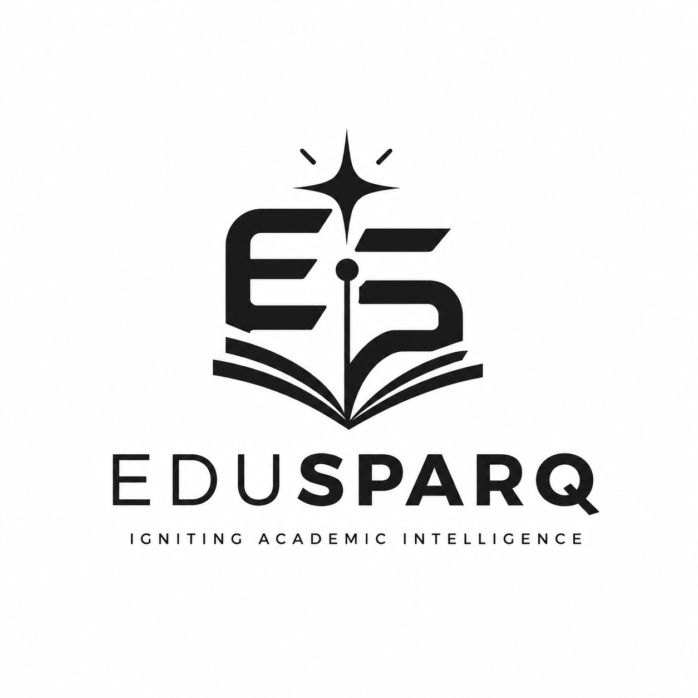

<div align="center">



# EduSparq

### Igniting Academic Intelligence

**Platform asisten akademik AI multi-agen untuk mahasiswa Indonesia**

[](https://nextjs.org/)
[](https://www.typescriptlang.org/)
[](https://www.mongodb.com/)
[](https://authjs.dev/)
[](https://build.nvidia.com)

</div>

---

## 🎯 Apa itu EduSparq?

EduSparq bukan sekadar chatbot AI. Ini adalah **platform akademik terpadu** yang menggabungkan:

- 🤖 **Multi-agent AI pipeline** (7 agen yang bekerja sama) — bukan satu prompt, tapi tim AI yang spesialisasi
- 🧠 **Memory system** — AI belajar preferensi setiap mahasiswa dari riwayat chat mereka
- 🎓 **Jurusan-aware** — AI tahu Anda Informatika atau Hukum, menyesuaikan jawaban & contoh
- 📱 **Telegram bot** — akses semua fitur dari chat Telegram, notifikasi deadline otomatis
- 📄 **File generation** — output AI langsung jadi file DOCX/Markdown siap submit
- 🔍 **Anti-halusinasi** — referensi wajib dari database jurnal Crossref (ada DOI), bukan karangan

> **Dibuat oleh [@chaoho554](https://twitter.com/chaoho554)** untuk mahasiswa Indonesia

---

## ✨ Fitur Utama

### 🧠 AI Center

| Fitur | Deskripsi |
|-------|-----------|
| **Copilot (Dashboard)** | Chat AI utama dengan orchestrator otomatis — pilih jalur terbaik (Simple/Medium/Complex) |
| **AI Hub** | 6 mode AI: Tutor, Agent, Dosen Virtual, Writing, Research, Hukum |
| **Agent Pipeline** | 7 agen: Classifier → Clarifier → Specifier → Planner → Tasker → Implementer → Reviewer |
| **Memory** | AI mengingat gaya belajar, fokus tugas, dan fakta preferensi setiap user |
| **Tools terintegrasi** | RAG materi, Crossref jurnal, web search, **KBBI lookup**, **Pasal.id hukum** |

### 📚 Akademik

| Fitur | Deskripsi |
|-------|-----------|
| **Materi Kuliah** | Upload PDF/DOCX → AI baca dan jadi basis jawaban (RAG) |
| **Mata Kuliah** | Kelola matkul, SKS, nilai — otomatis hitung IPK |
| **KRS & Nilai** | Import KRS, track IPK real-time |
| **Catatan Cerdas** | Rapikan coretan kuliah dengan AI |
| **Studio Menulis** | Draft makalah, outline, parafrase, sitasi APA/IEEE |
| **Persiapan Ujian** | Generate soal latihan + evaluasi jawaban |

### 🔬 Riset & Referensi

| Fitur | Deskripsi |
|-------|-----------|
| **Riset Akademik** | Eksplorasi topik + pencarian hukum (Pasal.id API) |
| **Literature Matrix** | Perbandingan matriks jurnal dari materi user |
| **Pustaka Jurusan** | Template mata kuliah populer untuk 17 jurusan, 4 fakultas |
| **Citation Grounding** | Referensi wajib dari Crossref (DOI valid) — anti-halusinasi |

### 💼 Karier

| Fitur | Deskripsi |
|-------|-----------|
| **Career Center** | Tren karir 2026, lowongan kerja terkurasi |
| **Skill Gap Analysis** | AI analisis: jurusan Anda → skill yang dibutuhkan → rekomendasi belajar |
| **CV Builder** | Generate CV ATS-friendly dalam Markdown |
| **Interview Coach** | Simulasi wawancara + feedback AI |

### 📋 Command Center

| Fitur | Deskripsi |
|-------|-----------|
| **Jadwal & Tenggat** | Manajemen deadline dengan prioritas otomatis |
| **Telegram Bot** | Akses semua fitur dari chat — notifikasi H-3 deadline + motivasi pagi 07:00 WIB |
| **Organisasi** | Kelola HIMA/BEM: struktur kepengurusan, divisi, program kerja |

---

## 🤖 Cara Kerja Multi-Agent System

EduSparq tidak pakai satu AI call. Setiap permintaan kompleks melewati **pipeline 7 agen**:

```
User: "Buat bab 3 skripsi tentang implementasi blockchain"

  ┌─────────────────────────────────────────────────────┐
  │ 1. CLASSIFIER (gratis)                               │
  │    → "Complex tier" (tugas berat, multi-langkah)     │
  ├─────────────────────────────────────────────────────┤
  │ 2. CLARIFIER                                         │
  │    → "Bagian blockchain apa? Konsensus? Smart contract?" │
  ├─────────────────────────────────────────────────────┤
  │ 3. SPECIFIER                                         │
  │    → Spec: BAB 3 metode, scope implementasi,         │
  │      batasan: bahasa baku, sitasi APA                │
  ├─────────────────────────────────────────────────────┤
  │ 4. PLANNER                                           │
  │    → Outline: 3.1 Arsitektur, 3.2 Algoritma,         │
  │      3.3 Implementasi, 3.4 Pengujian                 │
  ├─────────────────────────────────────────────────────┤
  │ 5. TASKER                                            │
  │    → 5 atomic tasks untuk Implementer                │
  ├─────────────────────────────────────────────────────┤
  │ 6. IMPLEMENTER (+ TOOLS)                             │
  │    → Cari materi user (RAG)                          │
  │    → Cari jurnal Crossref (DOI real)                 │
  │    → Cek KBBI (bahasa baku)                          │
  │    → Generate BAB 3 lengkap dengan referensi         │
  ├─────────────────────────────────────────────────────┤
  │ 7. REVIEWER                                          │
  │    → Audit: semua task terjawab? Referensi valid?    │
  │    → Score kualitas 0-100, revisi bila <75           │
  └─────────────────────────────────────────────────────┘
                           │
                           ▼
              Output: BAB 3 siap download (.docx)
              + 5 referensi jurnal dengan DOI
```

### 8 Tools yang Bisa Dipanggil Agent

| Tool | Fungsi | Sumber Data |
|------|--------|-------------|
| `search_material` | Cari di materi kuliah user | MongoDB RAG (PDF/DOCX yang diupload) |
| `search_journals` | Cari jurnal akademik | **Crossref API** (2 juta+ jurnal) |
| `web_search` | Cari info internet | Web search engine |
| `kbbi_lookup` | Cek kata baku Indonesia | **KBBI API** (Kemdikbud) |
| `search_law` | Cari UU/pasal | **Pasal.id API** |
| `get_courses` | Mata kuliah user | MongoDB |
| `get_deadlines` | Deadline terdekat | MongoDB |
| `get_memories` | Memori user | Memory engine |

---

## 🛠️ Tech Stack

### Frontend
- **Next.js 14** (App Router) + **React 18** + **TypeScript**
- **Tailwind CSS** + dark mode + **Framer Motion** animations
- **React Markdown** + **remark-gfm** untuk render output AI

### Backend
- **Next.js API Routes** (130 routes)
- **MongoDB Atlas** + **Mongoose** ODM
- **NextAuth v5** (JWT + Google OAuth)
- **OpenAI SDK** (compatible API untuk semua provider)

### AI Stack (Semua GRATIS/Murah)
| Provider | Model | Biaya |
|----------|-------|-------|
| **NVIDIA NIM** | DeepSeek V4 Pro | Gratis (community tier) |
| **Groq** | Llama 4 Scout 17B | Gratis (free tier) |
| **Moonshot** | Kimi K2.6 | Berbayar (fallback) |
| **OpenAI** | GPT-5 Mini | Berbayar (fallback) |

> Provider chain: NVIDIA → Groq → Moonshot → OpenAI (auto-fallback dengan circuit breaker)

### External APIs
- **PDDIKTI** — data kampus resmi Kemdiktisaintek
- **Crossref** — database jurnal akademik (2jt+ dengan DOI)
- **Pasal.id** — database hukum Indonesia
- **KBBI API** — Kamus Besar Bahasa Indonesia
- **Cloudinary** — upload materi
- **Pusher** — kolaborasi realtime

---

## 🚀 Quick Start

```bash
# Clone & install
git clone <repo-url>
cd edusparq-app
npm install

# Setup env
cp .env.local.example .env.local
# Edit .env.local — isi MONGODB_URI, NEXTAUTH_SECRET, NVIDIA_API_KEY

# Run
npm run dev
```

Buka [http://localhost:3000](http://localhost:3000)

### Environment Variables Wajib
```env
MONGODB_URI=mongodb+srv://...
NEXTAUTH_SECRET=<random-32-chars>
NVIDIA_API_KEY=nvapi-...        # AI gratis utama
```

Lihat [`.env.local.example`](.env.local.example) untuk semua opsi.

---

## 📂 Struktur Proyek

```
src/
├── app/
│   ├── (app)/              # 20+ halaman authenticated
│   │   ├── ai/             # AI Hub (6 mode)
│   │   ├── agents/         # Agent Pipeline runner
│   │   ├── workspace/      # Materi kuliah + RAG
│   │   ├── writing/        # Studio menulis (DOCX export)
│   │   ├── karir/          # Career Center (4 sub-pages)
│   │   ├── research/       # Riset + Hukum (Pasal.id)
│   │   ├── memory/         # AI Memory dashboard
│   │   └── ...
│   ├── api/                # 130 API routes
│   │   ├── agent/          # Multi-agent system
│   │   ├── chat/           # Chat AI (streaming)
│   │   ├── export/         # File download (MD/DOCX)
│   │   ├── telegram/       # Bot webhook + notify
│   │   ├── career/         # Career AI (skill-gap, CV, interview)
│   │   └── ...
│   └── page.tsx            # Landing page
├── lib/
│   ├── agents/             # 7 agen + 8 tools + orchestrator
│   ├── ai-client.ts        # Provider chain (NVIDIA→Groq→...)
│   ├── ai-memory.ts        # Per-user memory system
│   ├── jurusan-catalog.ts  # 17 jurusan × 4 fakultas
│   ├── file-generator.ts   # DOCX/Markdown generator
│   ├── credit-billing.ts   # Atomic credit deduction
│   └── ...
└── components/             # UI components
```

---

## 📱 Telegram Bot

Akses semua fitur EduSparq langsung dari Telegram:

| Command | Fungsi |
|---------|--------|
| `/start` | Menu utama (kategori: AI, Akademik, Tugas, Jadwal, Akun) |
| `/link <otp>` | Hubungkan akun EduSparq |
| `/saldo` | Cek credit |
| `/tugas` | Deadline terdekat |
| `/jadwal` | Jadwal hari ini |
| *pesan bebas* | Tanya AI langsung (via orchestrator) |

**Notifikasi otomatis:**
- ☀️ **Motivasi pagi 07:00 WIB** — sapaan + quote + jadwal + tugas hari ini
- ⏰ **Deadline H-3** — pengingat tugas sampai jatuh tempo
- ⚠️ **Low credit alert** — saldo < 50

---

## 🎓 Katalog Jurusan

AI EduSparq menyesuaikan jawaban untuk **17 jurusan** dalam **4 fakultas**:

| Fakultas | Jurusan |
|----------|---------|
| **Teknik & Informatika** ⚙️ | Teknik Informatika, Sistem Informasi, Teknik Elektro, Teknik Sipil |
| **Ekonomi & Bisnis** 📊 | Manajemen, Akuntansi, Ekonomi Pembangunan, Bisnis Digital |
| **Hukum** ⚖️ | Ilmu Hukum |
| **MIPA & Ilmu Alam** 🔬 | Matematika, Fisika, Kimia, Biologi, Farmasi, Pendidikan Dokter, Psikologi |

Setiap jurusan punya **prompt context** khusus (terminologi, contoh, gaya jawaban) + template mata kuliah populer.

---

## 📊 Statistik Platform

| Metrik | Angka |
|--------|-------|
| **Total routes** | 130 |
| **API endpoints** | 80+ |
| **AI agents** | 7 (Classifier → Reviewer) |
| **AI tools** | 8 (RAG, Crossref, KBBI, Pasal.id, dll) |
| **Jurusan didukung** | 17 (4 fakultas) |
| **AI providers** | 4 (NVIDIA, Groq, Moonshot, OpenAI) |
| **Cost per user/bulan** | **Rp 0-568** (via NVIDIA/Groq free tier) |

---

## 🔒 Keamanan

- **BYOK encryption** — API key user dienkripsi AES-256-GCM
- **Atomic billing** — credit deduction race-condition safe
- **NextAuth JWT** — tanpa DB roundtrip per request
- **Webhook admin-only** — Telegram setup hanya admin
- **No hallucination** — referensi wajib dari Crossref (DOI)

---

## 🚢 Deployment

### Vercel (Recommended)
```bash
# Push ke GitHub → import di Vercel → set env vars → deploy
# Setelah deploy: Settings → Telegram → daftarkan webhook
```

### Cron Setup (Notifikasi Telegram)
```
# cron-job.org atau GitHub Actions:
# 07:00 WIB (00:00 UTC): GET /api/telegram/notify?token=...&type=morning
# 07:00 & 19:00 WIB: GET /api/telegram/notify?token=...&type=deadline
```

---

## 🧪 Testing

```bash
# Smoke test (pastikan dev server running)
node scripts/smoke-test.mjs
```

---

## 📝 Lisensi

© 2026 EduSparq. Created by **[@chaoho554](https://twitter.com/chaoho554)**.

---

<div align="center">

**Igniting Academic Intelligence** 🔥

[🌐 Website](https://edusparq.app) · [📚 Docs](https://edusparq.app/docs) · [💬 Telegram](https://t.me/EduSparqBot) · [🐦 @chaoho554](https://twitter.com/chaoho554)

</div>
